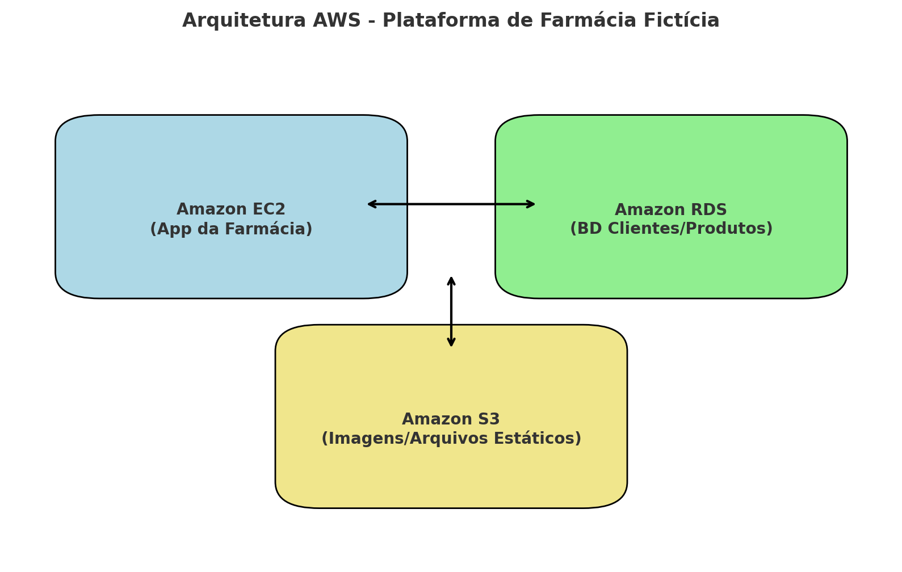

# 🏥💊 Plataforma Virtual de Farmácia - AWS  

  
  
  
  

---

## 📅 Informações do Projeto  
- **Data:** 25/08/2025  
- **Empresa:** *Abstergo Industries*  
- **Responsável:** **Yasmim dos Santos Farias**  

---

## 📖 Introdução  
Este relatório apresenta o processo de implementação de ferramentas na empresa fictícia **Abstergo Industries**, realizado por **Yasmim dos Santos Farias**.  

O objetivo do projeto foi:  
✨ **Conceber e projetar uma plataforma virtual para uma farmácia fictícia**, utilizando a infraestrutura da AWS.  

🔑 Destaques:  
- ✅ Elencar 3 serviços AWS principais.  
- ✅ Garantir **escalabilidade** e **segurança**.  
- ✅ Promover **redução de custos** com uso de nuvem.  

---

## ⚙️ Arquitetura do Projeto  

A plataforma foi estruturada em **3 etapas**, cada uma com foco em um serviço AWS:  

### 🚀 Etapa 1  
- **Ferramenta:** `Amazon S3`  
- **Foco:** Armazenamento e hospedagem de objetos.  
- **Caso de uso:** Catálogo de medicamentos, receitas digitalizadas e arquivos estáticos do sistema.  

### 🗄️ Etapa 2  
- **Ferramenta:** `Amazon RDS (MySQL)`  
- **Foco:** Banco de dados relacional.  
- **Caso de uso:** Cadastro de clientes, produtos, pedidos e prescrições médicas com backup automatizado.  

### 💻 Etapa 3  
- **Ferramenta:** `Amazon EC2`  
- **Foco:** Hospedagem da aplicação web.  
- **Caso de uso:** Servidor para o sistema principal da farmácia, integrando com S3 e RDS.  

---

## 🏗️ Diagrama da Arquitetura  

Abaixo está o diagrama representando a arquitetura do projeto na AWS:  

  

---

## ✅ Conclusão  
A implementação desta plataforma fictícia de farmácia na AWS demonstrou:  
- A **importância da computação em nuvem** na redução de custos.  
- O ganho de **escalabilidade** e **segurança** ao utilizar serviços como S3, RDS e EC2.  
- A prática de conceitos teóricos em um **cenário realista**.  

---

🚀 Esse projeto foi fundamental para aplicar meus conhecimentos em **arquitetura de nuvem** e **serviços AWS**.  

---

